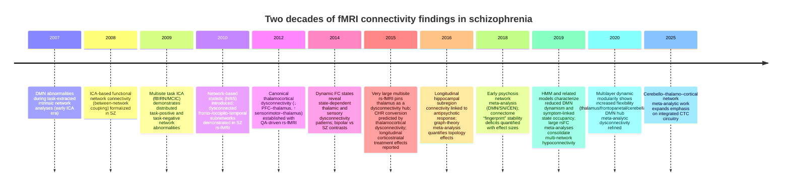

# Two decades of fMRI functional connectivity findings in schizophrenia versus healthy controls

## Executive summary

Across the past ~20 years (≈2006–2026), fMRI studies comparing schizophrenia (SZ) to healthy controls (HC) have converged on **distributed dysconnectivity** rather than focal abnormality, with the most reproducible and mechanistically interpretable results emerging when findings are framed at the level of **large-scale networks** (default mode, salience/ventral attention, central executive/frontoparietal control, sensory networks) and **cortico–subcortical hubs** (notably the thalamus, striatum, hippocampus, and cerebellum). citeturn6view2turn19view0turn24view2turn15view2

A strong contemporary consensus (supported by large samples, multisite aggregation, and multiple analytic families) is that SZ shows a **thalamocortical “bidirectional” signature**: **reduced thalamo–prefrontal** coupling alongside **increased thalamo–sensorimotor/sensory** coupling. This pattern appears in chronic samples after stringent QC, scales to very large pooled datasets, appears in dynamic analyses, and is detectable in clinical high-risk cohorts (with stronger effects among converters). **Primary sources** include entity["people","Neil D Woodward","psychiatry researcher"]’s rs-fMRI study (final n=77 HC / 62 SZ after QA), entity["people","Wei Cheng","computational psychiatry author"]’s 415 SZ / 405 HC multisite BWAS, entity["people","E Damaraju","neuroimaging author"]’s dynamic FNC multisite study (151 SZ / 163 HC), and entity["people","Alan Anticevic","neuroimaging researcher"]’s large clinical-high-risk conversion study (243 CHR / 154 HC). citeturn39view1turn15view2turn12view2turn15view1

At the level of canonical cortical networks, meta-analytic results emphasize **(i) frequent within-network hypoconnectivity** in DMN/self-referential and auditory/sensorimotor systems, and **(ii) substantial between-network dysconnectivity** involving salience/ventral-attention interactions with DMN and executive/frontoparietal systems. However, the literature also contains reproducible contexts where “hyperconnectivity” emerges—especially in **early-course/unmedicated cohorts** (e.g., robust prefrontal global connectivity increases) and in **specific dynamic states**. citeturn19view0turn24view2turn16view2turn12view3

Dynamic functional connectivity (dFC) work (sliding windows, HMMs, multilayer modularity) suggests SZ involves **abnormal occupancy/transition structure**: reduced time in strongly integrated states, altered switching among communities (notably involving thalamus and frontoparietal/cerebellar/subcortical modules), and symptom-linked preference for sensory-dominant/DMN-off states. Reported diagnostic classification using state descriptors is often in the ~75–85% range in specific datasets, emphasizing both potential and overfitting risk. citeturn12view3turn33view0turn29view0turn15view2

Graph-theory syntheses show **moderate effect-size reductions** in local organization and small-worldness (meta-analytic Hedges g ≈ −0.56 to −0.65), while global integration measures are more variable across studies and design contexts. citeturn6view3turn31search8turn31search0

Methodologically, two issues repeatedly determine the sign/magnitude of group effects: (1) **motion and related denoising**, and (2) **global signal treatment**. Motion produces systematic distance-dependent artifacts in FC (inflating local and reducing long-range correlations), and “best” denoising can differ by study objective; global signal regression (GSR) can attenuate clinically meaningful global variance differences in SZ and can shift whole-brain connectivity inferences. citeturn32search0turn2search29turn17view1turn32search3

## Scope and methodological framing

This report synthesizes fMRI evidence from approximately **March 2006 through March 2026** comparing FC differences in SZ versus HC, emphasizing findings that generalize across **seed-based FC**, **independent component analysis** (ICA) and **functional network connectivity** (FNC), **dynamic FC** families, and **connectomics/graph theory** and **network-based statistics** (NBS). The goal is not encyclopedic coverage of every paper, but a PhD-level analytic integration of robust patterns, moderators, and methodological determinants of reproducibility. citeturn19view0turn6view2turn25view0turn12view1

A key interpretational point is that “hypoconnectivity” and “hyperconnectivity” are not invariant labels: they depend on (i) whether FC is defined on **positive connectivity strength**, on **(anti)correlation structure**, or on **graph-derived topology**; (ii) whether the analysis targets within-network cohesion, between-network coupling, or hubness/centrality; and (iii) preprocessing steps (especially nuisance regression and GSR). A widely used operationalization in SZ meta-analysis defines **hypoconnectivity** as *reduced positive FC or increased negative FC* in SZ relative to HC, and **hyperconnectivity** as *reduced negative FC or increased positive FC* in SZ relative to HC. citeturn20view3turn17view1

Analytically, three families dominate the 20-year arc:

**Seed-based FC**: ROI/seed time series correlated with voxels or parcels; interpretable but sensitive to seed definition and multiple-comparisons correction. citeturn24view2turn19view0

**ICA/FNC**: decomposes data-driven components (RSNs or task-related networks) then tests within-component maps and/or between-component timecourse correlations. This approach supported early large-scale network work and multisite scaling (e.g., fBIRN/MCIC). citeturn10view0turn9view0turn12view3

**Graph/NBS**: connects many nodes into a connectivity matrix, then interrogates topology (efficiency, modularity, clustering, degree) or identifies dysconnected subnetworks while controlling family-wise error via network extent. citeturn6view3turn25view0turn28search0

## Static connectivity differences across large-scale networks

### Default mode network and self-referential circuitry

The DMN is among the earliest large-scale networks implicated by fMRI connectivity work in SZ. Early ICA evidence during an auditory oddball paradigm (N=21 SZ / 22 HC) showed **subregional DMN differences** (e.g., relatively greater activity/deactivation in anterior cingulate and parahippocampal/hippocampal regions in SZ, and greater posterior cingulate/precuneus effects in HC), alongside **abnormal temporal-frequency content** of the DMN timecourse; positive symptom severity correlated with DMN subregion effects, whereas negative symptom correlations were not detected in that sample. citeturn11view0

Meta-analytic syntheses indicate that **within-network DMN hypoconnectivity** is common in both chronic and early-psychosis samples, often involving medial prefrontal/anterior cingulate and posteromedial hubs, while heterogeneity across DMN subregions and illness stage contributes to apparent contradictions (reports of DMN hyperconnectivity in subsets). citeturn20view2turn24view2turn35view0turn19view0

A focused ALE meta-analysis of DMN intra-network connectivity abnormalities (studies from 2005–2019; 70 rs-fMRI studies, including major schizophrenia cohorts) emphasized hub-level dysconnectivity in anteromedial and posteromedial cortex, and noted that **unmedicated cohorts showed more DMN functional alterations**, highlighting medication status as a moderator in the apparent strength/extent of DMN findings across the literature. citeturn35view0

image_group{"layout":"carousel","aspect_ratio":"16:9","query":["default mode network diagram medial prefrontal posterior cingulate precuneus","salience network insula anterior cingulate diagram","central executive frontoparietal control network diagram"],"num_per_query":1}

### Salience network, ventral attention, and “switching” dysfunction

Large-scale meta-analytic work conceptualizing a salience/ventral-attention system as a core regulator supports the view that SZ involves **hypoconnectivity within salience-related circuitry** (e.g., involving anterior cingulate and putamen/insula nodes) and **hypoconnectivity between salience/ventral attention and DMN/frontoparietal systems**. citeturn20view2turn24view2turn19view0

In first-episode psychosis meta-analysis, salience seeds showed **hypoconnectivity with regions in DMN and CEN**, with additional reports of salience-related hyperconnectivity to sensory-processing regions. Importantly, this meta-analysis also reported that antipsychotic-treated first-episode samples showed **greater hypoconnectivity** between DMN/SN seeds and prefrontal regions than antipsychotic-naïve samples, reinforcing that “dysconnectivity” is partly entangled with treatment exposure and subgroup composition in cross-sectional studies. citeturn24view2

### Central executive/frontoparietal control and cognitive-control circuitry

Connectivity abnormalities affecting frontoparietal control networks appear consistently in network-level meta-analyses and in large task paradigms, but their directionality is more context dependent than the thalamocortical signature. In a large multisite ICA study during a working-memory Sternberg paradigm (n=115 chronic SZ / 130 HC), six networks differed between groups: multiple DMN subnetworks (task-negative) and task-positive networks including a DLPFC–parietal working-memory network and a cerebellar network, implying that SZ abnormalities span both **task-positive** and **task-anticorrelated** systems rather than localizing to “executive” cortex alone. citeturn10view0turn10view2

A complementary perspective is **stability/reliability of functional network patterns** across task states. A JAMA Psychiatry re-analysis of multiple n-back datasets (schizophrenia spectrum n=167; HC n=202) operationalized a “connectome fingerprint” stability as within-participant similarity between 0-back and 2-back networks, reporting **reduced stability** in SZ across full brain and multiple subnetworks including **frontoparietal**, **subcortical**, and **cerebellar** systems (e.g., full brain d≈−0.56; subcortical d≈−0.56; visual association d≈−0.44). Visual association stability related to 2-back performance (d≈0.36), linking connectome state stability to cognition. citeturn18view1

### Auditory, fronto-temporal language circuitry, and hallucination-linked dysconnectivity

Auditory/language network abnormalities are robust at multiple descriptive levels: within-network hypoconnectivity in auditory-network meta-analysis templates, altered coupling between auditory components and salience/self-referential systems, and symptom-linked changes in fronto-temporal integration.

A large meta-analysis of seed-based rsFC studies mapped to ICA templates (76 rsFC studies; 2,588 SZ / 2,567 HC) reported **hypoconnectivity within the auditory network** (including effects involving the insula) and DMN/self-referential systems, framing these as diffuse disconnections consistent with a dysregulated network model. citeturn19view0

Early ICA-based FNC work (29 SZ / 25 HC) found that the **default-mode component** showed more consistent connectivity with other components in SZ than in controls, and group-difference tests identified several component-pair differences where SZ showed greater mean correlations, supporting an early “less specialized / more entangled” large-scale coupling interpretation that remains influential in contemporary discussions of network segregation failure. citeturn9view0turn7view2

Within the hallucination-treatment literature, a proof-of-concept real-time fMRI neurofeedback study targeting left superior temporal gyrus (STG) reported that successful down-regulation of STG activity was followed by increased FC between left STG and left inferior frontal gyrus (IFG), and that STG–IFG FC increase associated with reduced AVH symptoms during training—consistent with the view that modulating **speech-perception–speech-production coupling** can alter symptom expression in at least some patients. citeturn36view0

### Visual and sensory systems

Visual network findings illustrate two broader themes: (i) sensory systems are implicated in SZ beyond auditory cortex, and (ii) some of the most replicable “hyperconnectivity” signals are **thalamus-to-sensory** rather than cortex-to-cortex.

Dynamic and static ICA-based analyses of multisite resting-state data (151 SZ / 163 HC) found **thalamic hyperconnectivity with auditory, motor, and visual networks**, and reduced connectivity between sensory networks across modalities; critically, several subcortical–sensory abnormalities were most prominent in specific dynamic states rather than in static averages. citeturn12view2turn12view3

At the reliability/stability level, reduced connectome fingerprint stability in SZ was observed in **visual networks** (both early visual and visual association) as well as in motor and cerebellar networks, suggesting that sensory-network organization is not only altered in mean FC but also in within-person consistency across cognitive states. citeturn18view1

### Thalamocortical circuitry and cortico–subcortical hubs

The thalamus has emerged as a cross-method and cross-sample **connectivity hub** in SZ, with unusually consistent directionality: thalamo-prefrontal weakening and thalamo-sensory strengthening.

A carefully quality-controlled rs-fMRI study derived from 160 scanned individuals reported final sample sizes of **77 HC and 62 SZ** after excluding scans failing QA. It found significantly reduced prefrontal–thalamic connectivity (mediodorsal/anterior thalamic nuclei targets) and increased motor/somatosensory–thalamic connectivity—differences reported as unrelated to antipsychotic dose in that dataset. citeturn39view1turn15view0

A major multisite, brain-wide association study pooling **415 SZ and 405 HC** across multiple countries identified the thalamus as a key hub for altered functional networks; the most significant aberration was increased thalamus–primary somatosensory cortex connectivity (P≈10^−18), with widespread thalamo-sensory increases and weakened thalamo-frontal connectivity. The study also reported symptom/illness-duration correlations and SVM discrimination accuracies ≈73–81% (dataset-dependent), illustrating both replicability and the temptation to overinterpret classification in heterogeneous clinical populations. citeturn15view2

In clinical high-risk youth/young adults (243 CHR; 154 HC; 2-year follow-up), baseline thalamocortical dysconnectivity resembled the SZ pattern and was more pronounced in those who converted (n=21): prefrontal/cerebellar hypoconnectivity (t≈3.77; Hedges g≈0.88) and sensory–motor hyperconnectivity (t≈2.85; Hedges g≈0.66), each correlating with prodromal symptom severity (r≈0.27). citeturn15view1

### Hippocampal and cerebellar networks

Hippocampal FC abnormalities are supported by medication-naïve and longitudinal designs, particularly when hippocampal subregions are separated. In a longitudinal rs-fMRI study of unmedicated SZ, anterior and posterior hippocampal seeds showed widespread aberrant connectivity (notably to medial cortical regions), and baseline connectivity to regions including auditory cortex, lingual gyrus, caudate, and dorsal anterior cingulate was related to treatment response after 6 weeks; connectivity patterns changed over time as a function of response. citeturn24view1

Cerebellar involvement appears at multiple levels: as a task-positive ICA network differing in SZ (multisite Sternberg), as a stability deficit (connectome fingerprint), as part of dynamic modular abnormalities, and as a locus of DMN coupling differences in early psychosis. citeturn10view2turn18view1turn29view0turn24view2

One concrete developmental/at-risk cerebellar observation comes from a seed-based rs-fMRI study that compared ultra-high risk, first-episode drug-naïve SZ, and HC, reporting **increased cerebellar–DMN connectivity** in first-episode drug-naïve SZ and raising the question of whether cerebellar–DMN coupling changes predate onset. citeturn21search6

## Task-based fMRI connectivity and network reconfiguration

The task-versus-rest contrast in SZ is best understood as a difference in **network recruitment and suppression** rather than a simple on/off switch for “connectivity abnormalities.” Early influential work used task paradigms as controlled contexts to identify intrinsic networks (e.g., extracting DMN during oddball) and showed that network properties (including timecourse frequency content and symptom associations) differ in SZ even when task performance is broadly comparable. citeturn11view0

Large multisite task ICA results demonstrate that SZ abnormalities span multiple DMN subnetworks and at least two task-positive networks (frontoparietal WM and cerebellar), supporting a model in which impaired cognition reflects not only reduced executive recruitment but also abnormal interaction between task-positive and task-negative systems. citeturn10view2

Task-based connectome stability analysis provides a distinct but compatible signal: reduced within-person similarity of functional networks across task loads suggests impaired capacity to maintain individualized network organization under changing cognitive demands, with network-specific associations to performance. citeturn18view1

## Dynamic connectivity and graph-theoretic organization

### Dynamic connectivity: states, occupancy, and switching

A central lesson of dFC in SZ is that mean/static FC can obscure abnormalities that are **state dependent**. In a large multisite ICA study, static FNC found thalamus–sensory hyperconnectivity and sensory–sensory hypoconnectivity, while dynamic sliding-window clustering showed that SZ participants spent much less time in states characterized by strong large-scale connectivity and that some subcortical abnormalities (e.g., putamen–sensory hypoconnectivity) were evident only during specific states. citeturn12view3

Related dynamic-state work comparing SZ, bipolar disorder, and HC (including 60 SZ and 61 HC) emphasized that dynamic FNC can reveal diagnostic group differences not present in stationary averages, reinforcing that “inconsistency” in older connectivity results can reflect time-averaging across heterogeneous internal states. citeturn12view1

Hidden Markov modeling of RSN activation dynamics (41 SZ / 41 HC) extends this to a temporally principled framework: SZ showed reduced fractional occupancy of states characterized by higher DMN and executive activation and longer mean lifetimes of DMN-on/DMN-off sensory-antagonistic states. Positive symptom severity associated with greater time in states with inactive DMN/executive and heightened sensory activity, and classifiers trained on state descriptors predicted diagnosis with ~76–85% accuracy in that dataset. citeturn33view0

Multilayer community detection work in the COBRE dataset (55 SZ / 72 HC) reported higher “flexibility” (more frequent switching between communities) at RSN and node levels, including increased flexibility in cerebellar, subcortical, and frontoparietal task-control RSNs and particularly in thalamus, where flexibility reflected transitions between DMN and sensory-somatomotor communities; importantly, the paper also noted that flexibility results depend on methodological choices such as window size and can be mediated by simpler time-window correlation measures. citeturn29view0

### Graph theory: degree, modularity, efficiency, and small-worldness

A meta-analysis of whole-brain functional network architecture studies (13 studies) quantified consistent topology changes in SZ: significant decreases in local organization (clustering coefficient/local efficiency; g≈−0.56) and decreases in small-worldness (g≈−0.65), while global short communication paths appeared more preserved (global efficiency/path length meta-effect g≈0.26, nonsignificant), underscoring that local segregation deficits are more consistent than global integration deficits across varied pipelines. citeturn6view3

Individual graph-theory studies highlight developmental and thresholding sensitivity. For example, resting-state graph analysis in childhood-onset SZ (13 COS / 19 HC) reported reduced clustering and modularity alongside greater connectedness/robustness and global efficiency, emphasizing that developmental stage and graph construction rules can change the apparent segregation–integration balance. citeturn31search8turn31search1

ICA-derived FNC graph approaches (19 SZ / 19 HC) have also reported altered small-world properties with topological measures correlated with negative symptoms (PANSS), linking topology to clinical phenotype while illustrating small-sample fragility. citeturn31search0turn31search4

### Network-based statistics and dysconnected subnetworks

NBS was introduced as a family-wise error–controlling approach that exploits the connected extent of suprathreshold edges, analogous to cluster inference in voxelwise SPM. Its demonstration on resting-state fMRI data found an expansive dysconnected subnetwork in SZ, primarily comprising fronto-temporal and occipito-temporal dysconnections; this pattern was not detected by FDR-controlled mass-univariate edge testing in that demonstration, motivating NBS as a principled “network-level” inferential tool. citeturn25view0turn28search0

## Medication, illness stage, and symptom dimensions

### Medication exposure and short-term treatment effects

Medication effects are difficult to separate from illness effects because many chronic samples are medicated and many first-episode cohorts initiate treatment rapidly. This limitation is explicit in large meta-analytic work, where medication and first-episode/chronic distinctions were sometimes not analyzable due to imbalance between medicated and unmedicated studies. citeturn20view1

Nevertheless, several longitudinal and early-phase studies give convergent signs that treatment modulates specific circuits:

A 12-week prospective controlled study in first-episode psychosis (24 patients; 24 matched HC; risperidone or aripiprazole) found that **as psychosis improved**, striatal FC increased with anterior cingulate, DLPFC, and limbic regions such as hippocampus and anterior insula; relationships with reduction in psychosis were negative for some parietal-coupled striatal connections. This supports a state-dependent model of corticostriatal dysconnectivity and suggests that symptom reduction is accompanied by specific cortico–striatal “re-coupling.” citeturn24view0

In early-phase SZ, an rs-fMRI study focusing on DMN and salience networks reported FC abnormalities in unmedicated patients and FC changes after 6–8 weeks of atypical antipsychotic treatment, while also emphasizing limitations (small sample, network-template choices, heterogeneous medications) and inconsistent SN literature. citeturn22view0

In unmedicated SZ with longitudinal follow-up, hippocampal subregion connectivity patterns predicted clinical response and showed response-linked change over time, tying limbic dysconnectivity to treatment dynamics rather than treating it purely as a static trait abnormality. citeturn24view1

### Illness stage: early-course hyperconnectivity versus chronic hypoconnectivity

Illness stage is one of the clearest explanations for why “hyperconnectivity” and “hypoconnectivity” can both be true in the literature. In early-course, non-medicated SZ (129 early-course SZ / 106 HC), whole-brain and PFC-focused global connectivity analyses reported robust **prefrontal hyperconnectivity** (Cohen’s d≈0.84) with comparatively modest evidence for hypoconnectivity (d≈−0.29), with partial normalization in a longitudinal subset (n=25) predicting symptom improvement; the study also presented sensitivity analyses without GSR demonstrating qualitative robustness of key clinical effects in that dataset. citeturn16view2

In contrast, large cross-sectional chronic-sample work and rsFC meta-analyses more often emphasize widespread hypoconnectivity within and between canonical networks (DMN, salience/ventral attention, sensory and auditory systems), likely reflecting a mixture of chronic disease processes, treatment exposure, and survivorship/selection effects. citeturn19view0turn20view2turn35view0

### Symptom and cognitive correlations

Symptom correlations are repeatedly reported, but their robustness is limited by measurement heterogeneity and by circularity risk when connectivity features are selected based on group differences and then correlated with symptoms.

Several relatively well-specified examples include:

- DMN subregion effects correlating with positive symptoms (PANSS) in early ICA-task work, with no detected negative-symptom correlations in that sample. citeturn11view0  
- Dynamic-state occupancy measures associating positive symptom severity with increased time in sensory-high / DMN-low and executive-low states. citeturn33view0  
- Thalamocortical dysconnectivity correlating with prodromal symptom severity in CHR youth and showing large effect sizes in converters. citeturn15view1  
- First-episode psychosis meta-analysis reporting negative symptoms positively correlated with DMN FC abnormalities, and suggesting medication-treated cohorts show greater prefrontal hypoconnectivity. citeturn24view2  
- Connectome stability in visual association network relating to 2-back performance, linking a network-level reliability property to cognitive function. citeturn18view1  

## Effect sizes, reproducibility, preprocessing choices, and confounds

### Effect sizes and sample-size evolution

A practical synthesis of reported magnitude across core findings:

- **Graph topology**: moderate meta-analytic effects for reduced local organization (g≈−0.56) and reduced small-worldness (g≈−0.65). citeturn6view3  
- **Connectome stability**: small-to-moderate reductions across multiple subnetworks (e.g., full brain d≈−0.56; visual association d≈−0.44; frontoparietal d≈−0.30). citeturn18view1  
- **Illness-stage hyperconnectivity**: early-course unmedicated PFC global connectivity increase d≈0.84 (with modest hypoconnectivity d≈−0.29). citeturn16view2  
- **Clinical-high-risk conversion**: thalamo-prefrontal/cerebellar hypoconnectivity g≈0.88 and sensory–motor hyperconnectivity g≈0.66 in converters. citeturn15view1  

Sample sizes have expanded from **~20–60 per group** (e.g., 21/22; 29/25) to **hundreds** in multisite datasets and **thousands** in meta-analytic integrations. This evolution altered what is detectable: large-sample thalamocortical hub effects show particularly strong replication, while cortex–cortex network findings remain more heterogeneous and pipeline sensitive. citeturn11view0turn0search4turn15view2turn19view0turn35view0

### Motion, denoising, and global signal regression

Head motion is not a nuisance detail in SZ FC studies; it can generate systematic artifactual correlation structure (decreasing long-distance correlations and increasing short-distance correlations) even after registration and conventional regression, and can therefore mimic “dysconnectivity.” citeturn32search0

Evaluations of motion correction strategies emphasize that efficacy, reliability, and sensitivity trade off across pipelines and goals, and that denoising choices can substantially affect between-group effects in clinical populations. citeturn2search29turn32search1

Global signal is especially consequential in SZ: large samples show **increased global signal power and variance** in chronic SZ relative to controls, with effects predictive of symptoms and attenuated by GSR; voxelwise variance increases were also observed, and the authors warned that GSR can obscure clinically meaningful global variance differences and qualitatively shift whole-brain connectivity inferences (illustrated for rGBC). citeturn17view1

Given these findings, a minimum standard for interpretable SZ FC results is to **explicitly report** (i) motion metrics and group differences, (ii) denoising pipeline and QC-FC checks, and (iii) sensitivity analyses with and without GSR when claims hinge on anticorrelations or whole-brain connectivity shifts. citeturn32search0turn17view1turn32search3turn2search29

### Common confounds that systematically shape SZ–HC connectivity contrasts

Confounds repeatedly implicated across the literature include: differential motion and physiological noise; scanner/site effects in multisite studies; antipsychotic exposure and heterogeneity of compounds/dose; illness duration and symptom severity distributions; comorbid substance use; and analytic multiplicity (parcellation choice, thresholding, edge definition, and dynamic window parameters). These issues are explicitly discussed in multisite and dynamic modularity work and routinely appear as limitations in primary studies and meta-analyses. citeturn39view1turn29view0turn24view2turn20view1turn17view1

### Selected key studies table

**Table A: Landmark static network and hub findings (resting-state and task-extracted intrinsic networks)**

| Study (first author) | Year | Cohort size (SZ vs HC) | Approach | Main connectivity result (SZ vs HC) | Effect size / key statistic |
|---|---:|---:|---|---|---|
| entity["people","A Garrity","psychiatry researcher"] | 2007 | 21 vs 22 | ICA-extracted DMN during auditory oddball | DMN subregion differences; altered DMN timecourse frequency content; positive symptom correlations in DMN subregions; no negative-symptom correlation detected in that sample | Group template correlation difference t≈5.32 (df=41); frequency-bin differences reported with corrected p-values citeturn11view0 |
| entity["people","M Jafri","neuroimaging author"] | 2008 | 29 vs 25 | Group ICA + FNC (between-component correlations / lag) | DMN component showed more consistent connectivity with other components in SZ; group differences favored higher correlations in SZ for most significant component pairs | 5/21 component-pair differences at p<0.01; SZ higher mean correlation in 4/5 differences citeturn7view2turn9view0turn0search4 |
| entity["people","Dae Il Kim","neuroimaging author"] | 2009 | 115 vs 130 | Multisite task ICA (Sternberg WM; fBIRN/MCIC) | Six networks differed: multiple DMN subnetworks (task-negative) and task-positive WM and cerebellar networks; emphasizes aberrant task-positive and task-negative systems | Effect sizes not specified in abstracted results; multisite scale is key contribution citeturn10view0turn10view2 |
| (Woodward) | 2012 | 62 vs 77 (final after QA) | Seed-based cortical ROI → thalamus rsFC | Reduced prefrontal–thalamic FC and increased motor/somatosensory–thalamic FC; no temporal/parietal/occipital thalamic differences; medication dose not linked to abnormalities in that dataset | Peak T values (e.g., ~4.85–6.40 in reported clusters) with corrected p-values; QC exclusions documented citeturn39view1 |
| (Anticevic) | 2013 | 90 vs 90 | Anatomically defined thalamic seeds; clustering and classification | Thalamic overconnectivity with sensory-motor cortex and underconnectivity with prefrontal–striatal–cerebellar regions; symptoms predicted by sensory-motor pattern | Effect sizes not in abstract; sample size and directional pattern highlighted citeturn13view0 |
| (Cheng) | 2015 | 415 vs 405 | Brain-wide association study (rest); multisite | Thalamus emerged as key dysconnectivity hub; increased thalamus–primary somatosensory FC most significant; thalamo-frontal weakened; symptom/illness-duration correlations; SVM discrimination reported | P≈10^−18 for top thalamo-somatosensory link; SVM accuracy ≈73.5–80.9% citeturn15view2 |
| (Dong) | 2018 | Meta-analysis (studies through 2015) | MKDA; within- and between-network dysconnectivity mapping | Hypoconnectivity within default, ventral attention/salience, thalamus, somatosensory/language networks; broad between-network hypoconnectivity; limited hyperconnectivity mainly AN–VAN | Hyper/hypo definitions explicit; illness-duration moderation for DN–insula reported; medication/first-episode not analyzable due study imbalance citeturn20view2turn20view1 |
| (Li) | 2019 | 2,588 vs 2,567 (76 rsFC studies) | Meta-analysis mapped to ICA templates | Hypoconnectivity within auditory, “core/cognitive control,” DMN, self-referential, and somatomotor networks | Max-P density statistics and coordinates provided; emphasizes diffuse hypoconnectivity model citeturn19view0 |
| (O’Neill) | 2018 | FEP meta-analysis | Seed-based d mapping meta-analysis | DMN mainly within-network hypoconnectivity; SN hypoconnectivity with DMN/CEN; CEN mixed; negative symptoms correlated with DMN abnormalities; treated FEP showed greater prefrontal hypoconnectivity | Effect directions and subgroup medication moderation reported citeturn24view2 |
| (Doucet) | 2020 | 70 studies; 2,789 patients & 3,002 HC (transdiagnostic) | ALE meta-analysis of intra-DMN cohesion | Hub-level DMN dysconnectivity in anteromedial/posteromedial cortex; schizophrenia-specific hypoconnectivity in posteromedial cluster; unmedicated patients showed more DMN alterations | No single g/d reported; emphasis on hub-level phenotypes and medication moderation citeturn35view0 |

**Table B: Dynamic connectivity, topology, treatment modulation, and preprocessing determinants**

| Study (first author) | Year | Cohort size (SZ vs HC) | Approach | Main finding (SZ vs HC) | Effect size / key statistic |
|---|---:|---:|---|---|---|
| (Damaraju) | 2014 | 151 vs 163 | ICA (47 ICNs) + static & sliding-window dFNC + k-means states | Static: thalamus–sensory hyperconnectivity + sensory–sensory hypoconnectivity; Dynamic: SZ spend less time in strongly connected states; some subcortical effects emerge only in specific states | Effect sizes not reported in abstract; state dependence emphasized citeturn12view2turn12view3 |
| (Rashid) | 2014 | 60 vs 61 | ICA ICNs + static/dynamic FNC states | Dynamic connectivity states reveal group differences not captured by static averages | Sample sizes and rationale explicit; state-specificity emphasized citeturn12view1 |
| (Kottaram) | 2019 | 41 vs 41 | HMM on 14 RSNs → 12 states + symptom CCA | SZ spend less time in DMN/executive-high states; DMN activates less often but episodes last longer; positive symptoms relate to sensory-high/DMN-off state occupancy; classification accuracy 76–85% | Accuracy 76–85%; occupancy differences described citeturn33view0 |
| (Gifford) | 2020 | 55 vs 72 | Multilayer community detection; flexibility | Higher flexibility in SZ in cerebellar/subcortical/frontoparietal RSNs and thalamus; thalamus flexibility reflects DMN↔sensory transitions; flexibility depends on window size | F statistics reported (e.g., thalamus F≈17.1; pFDR<0.001) citeturn29view0 |
| entity["people","J Kambeitz","psychiatry researcher"] | 2016 | Meta-analysis (13 studies) | Graph-theory metrics meta-analysis | Decreased local organization (g≈−0.56) and small-worldness (g≈−0.65); global efficiency/path length more preserved (g≈0.26, ns) | Hedges g values directly reported citeturn6view3 |
| (Kaufmann) | 2018 | 167 vs 202 | Connectome fingerprint stability across n-back loads | Reduced stability in SZ across full brain and multiple subnetworks; stability relates to performance (visual association) and polygenic risk (motor) | Cohen’s d across networks (e.g., full brain d≈−0.56) citeturn18view1 |
| (Yu) | 2011 | 19 vs 19 | ICA timecourses → partial correlation FNC → small-world metrics | Altered topological properties; correlations between topological measures and negative symptoms | Sample size specified; symptom associations noted citeturn31search0turn31search4 |
| (Alexander-Bloch) | 2010 | 13 vs 19 | Wavelet correlation graph theory; modularity/clustering | Reduced clustering and modularity; altered segregation/integration balance in childhood-onset SZ | Directional interpretation highlighted; sample size specified citeturn31search8turn31search1 |
| (Sarpal) | 2015 | 24 vs 24 | Longitudinal rsFC; seed-based striatal connectivity | Symptom improvement associated with increased striatal FC to ACC/DLPFC/hippocampus/insula; suggests state-dependent corticostriatal dysconnectivity | Relationships with symptom reduction reported; modest sample explicitly noted citeturn24view0 |
| (Yang) | 2014 | SZ n=90 & 71; HC n=220; BD n=73 | Global signal power/variance; GSR impact | Increased global signal power/variance in SZ (replicated); predictive of symptoms; attenuated by GSR; warns GSR can obscure meaningful effects and shift rGBC patterns | F-statistics for GS power/variance; symptom correlation r≈0.18; GSR attenuation shown citeturn17view1 |
| (Parkes) | 2018 | Not specified here | Evaluation of motion correction strategies | Motion correction choices influence efficacy/reliability/sensitivity; denoising can change contrasts, relevant in clinical group comparisons | Methodological determinants emphasized; motion sensitivity central citeturn2search29turn33view0 |
| (Power) | 2012 | Not an SZ-specific cohort | Motion artifact characterization | Motion produces systematic spurious correlation structure (reduces long-distance, increases short-distance FC), impacting rsFC inference | Qualitative and quantitative demonstration; foundational confound source citeturn32search0 |

### Timeline of major discoveries

This timeline is grounded in primary and meta-analytic sources spanning early DMN ICA (2007), ICA-FNC (2008), multisite task ICA (2009), NBS (2010), thalamocortical rsFC (2012), dynamic FC states (2014), large multisite thalamic hub work and CHR conversion prediction (2015), hippocampal longitudinal treatment response (2016), network-level early psychosis and connectome stability quantification (2018), HMM-based dynamics (2019), and multilayer network flexibility plus DMN hub meta-analysis refinement (2020). citeturn11view0turn9view0turn10view0turn25view0turn39view1turn12view3turn15view2turn15view1turn24view1turn18view1turn33view0turn29view0turn35view0

## Methodological recommendations and open problems

The last 20 years of SZ FC research suggests several “best practice” principles that specifically address why results have historically diverged. These recommendations are directly motivated by empirical demonstrations of motion artifact, global signal differences in SZ, dynamic-state dependence of group effects, and graph/dynamic parameter sensitivity. citeturn32search0turn17view1turn12view3turn29view0turn6view3

1) **Treat thalamocortical effects as a benchmark validity target**. Because the thalamo–PFC hypo / thalamo–sensory hyper motif replicates across multiple high-powered studies and analytic families, pipelines that fail to detect it in large-enough clinical datasets may warrant careful QA scrutiny (motion, censoring thresholds, site effects, parcellation). citeturn39view1turn15view2turn12view3turn15view1

2) **Make motion handling auditable and quantitatively tied to FC**: report FD and DVARS distributions; test QC–FC and distance dependence; show that group differences survive reasonable censoring/denoising perturbations. This is essential because motion can systematically bias short- vs long-range FC in precisely the direction often interpreted as “dysconnectivity.” citeturn32search0turn2search29

3) **Explicitly justify global signal strategy and run sensitivity analyses**. SZ shows altered global signal variance/power predictive of symptoms, and GSR can attenuate/shift group inferences; consequently, “with vs without GSR” should be treated as a core robustness check when key conclusions depend on anticorrelations, whole-brain connectivity, or small effect sizes. citeturn17view1turn32search3turn16view2

4) **Prefer designs that disambiguate illness, medication, and stage**: CHR→conversion, first-episode medication-naïve, within-subject treatment longitudinal designs, and careful symptom-domain modeling reduce ambiguity that meta-analyses repeatedly flag as a limitation (e.g., imbalance of medicated vs unmedicated studies). citeturn15view1turn24view0turn24view1turn20view1turn24view2

5) **Dynamic analyses should be pre-registered or at least parameter-swept**. State metrics (occupancy, transitions, flexibility) can be clinically informative but depend on window/state model choices; papers explicitly show window-size sensitivity and mediation by simpler measures, so interpretability requires transparent parameter dependence and external validation. citeturn12view3turn29view0turn33view0

6) **Graph-theory results should be reported as curves across density/thresholds (or with principled weighted metrics)**, and studies should avoid single-threshold conclusions when possible. Meta-analytic results suggest local segregation deficits are more consistent than global integration measures—so studies should report multiple complementary metrics (clustering/local efficiency, modularity, participation/degree) and interpret them in light of construction rules. citeturn6view3turn31search8turn31search0

Open problems suggested by the best-supported evidence are: how thalamocortical dysconnectivity mechanistically links to specific symptom dimensions; whether early-course hyperconnectivity transitions to chronic hypoconnectivity within the same individuals (beyond limited longitudinal subsets); whether network-state markers generalize across sites and pipelines with clinically useful individual-level precision; and how much of “dysconnectivity” represents compensatory reconfiguration versus primary pathophysiology. These remain unresolved in the strongest sources and are explicitly highlighted as limitations or future directions in large multisite, CHR, and dynamic studies. citeturn15view2turn15view1turn16view2turn29view0turn24view2turn20view1